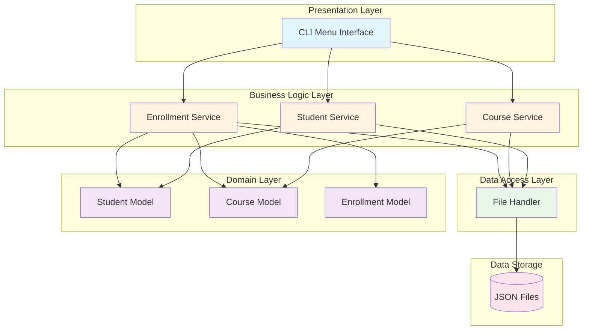
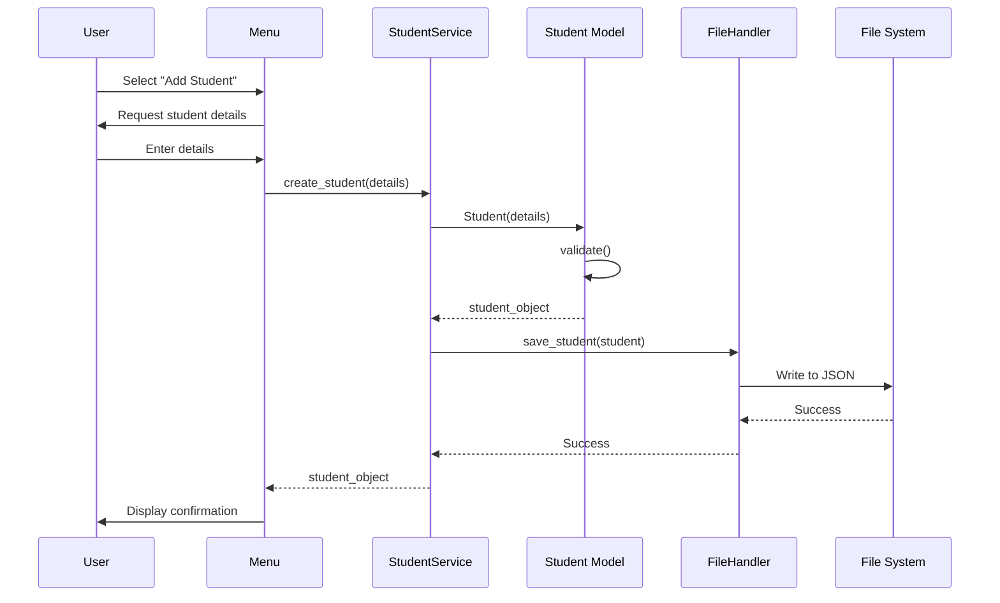
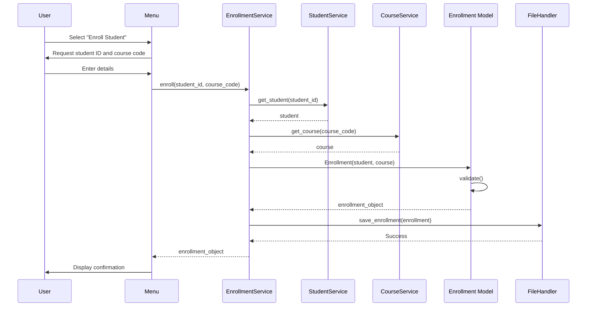

# System Architecture

## Overview

The Student Course Management System follows a **layered architecture** pattern with clear separation of concerns. The system is organized into distinct layers, each with specific responsibilities.

## Architecture Diagram

## Layers

### 1. Presentation Layer (`ui/`)

**Responsibility**: User interaction and interface

- **Components**:
  - `menu.py`: CLI menu system for user interaction

- **Responsibilities**:
  - Display menus and options
  - Capture user input
  - Validate basic input format
  - Display results to user
  - Handle user navigation

### 2. Business Logic Layer (`services/`)

**Responsibility**: Application logic and business rules

- **Components**:
  - `student_service.py`: Student-related operations
  - `course_service.py`: Course-related operations
  - `enrollment_service.py`: Enrollment and grade management

- **Responsibilities**:
  - Implement business rules
  - Coordinate between models and data layer
  - Perform complex operations (e.g., GPA calculation)
  - Enforce validation rules
  - Handle error conditions

### 3. Domain Layer (`models/`)

**Responsibility**: Core business entities and rules

- **Components**:
  - `student.py`: Student entity and validation
  - `course.py`: Course entity and validation
  - `enrollment.py`: Enrollment entity and GPA logic

- **Responsibilities**:
  - Define domain entities
  - Encapsulate business data
  - Implement entity-specific validation
  - Provide entity behavior methods

### 4. Data Access Layer (`data/`)

**Responsibility**: Data persistence and retrieval

- **Components**:
  - `file_handler.py`: File I/O operations

- **Responsibilities**:
  - Read data from files
  - Write data to files
  - Serialize/deserialize objects
  - Handle file system errors
  - Manage data format conversions

## Data Flow

### Adding a Student

### Enrolling a Student

## Design Principles

### 1. Separation of Concerns
- Each layer has a single, well-defined responsibility
- Changes in one layer have minimal impact on others
- Easy to test each layer independently

### 2. Dependency Injection
- Services receive their dependencies
- Promotes loose coupling
- Facilitates unit testing

### 3. Single Responsibility Principle
- Each class/module has one reason to change
- Models focus on data and validation
- Services focus on business logic
- UI focuses on presentation

### 4. Open/Closed Principle
- System is open for extension
- Closed for modification
- New features can be added without changing existing code

## Error Handling Strategy

### Layered Error Handling

1. **Model Layer**: Validation errors
   - Invalid data format
   - Business rule violations
   - Data type mismatches

2. **Service Layer**: Business logic errors
   - Resource not found
   - Duplicate entries
   - Constraint violations

3. **Data Layer**: I/O errors
   - File not found
   - Permission errors
   - Corruption errors

4. **UI Layer**: User-friendly messages
   - Display clear error messages
   - Guide user to resolution
   - Log technical details

## Extensibility

The architecture supports future extensions:

### Database Support
- Replace `file_handler.py` with `database_handler.py`
- Implement same interface
- No changes needed in services or models

### Web Interface
- Add `web/` directory for web UI
- Reuse existing services
- No changes to business logic

### Additional Features
- New models can be added to `models/`
- New services extend existing services
- Minimal impact on existing code

## Performance Considerations

### Current Approach
- In-memory data structures for active operations
- File I/O for persistence
- Suitable for small to medium datasets

### Future Optimizations
- Caching frequently accessed data
- Lazy loading for large datasets
- Database indexing for searches
- Background saving for better UX

## Security Considerations

### Data Validation
- Input validation at model layer
- SQL injection prevention (if database added)
- Path traversal prevention in file operations

### Access Control
- Future: Role-based access control
- Future: Authentication system
- Future: Audit logging

## Testing Strategy

### Unit Tests
- Test each layer independently
- Mock dependencies
- Focus on business logic

### Integration Tests
- Test interaction between layers
- Verify data flow
- Test error handling

### End-to-End Tests
- Test complete user scenarios
- Verify system behavior
- Test data persistence
