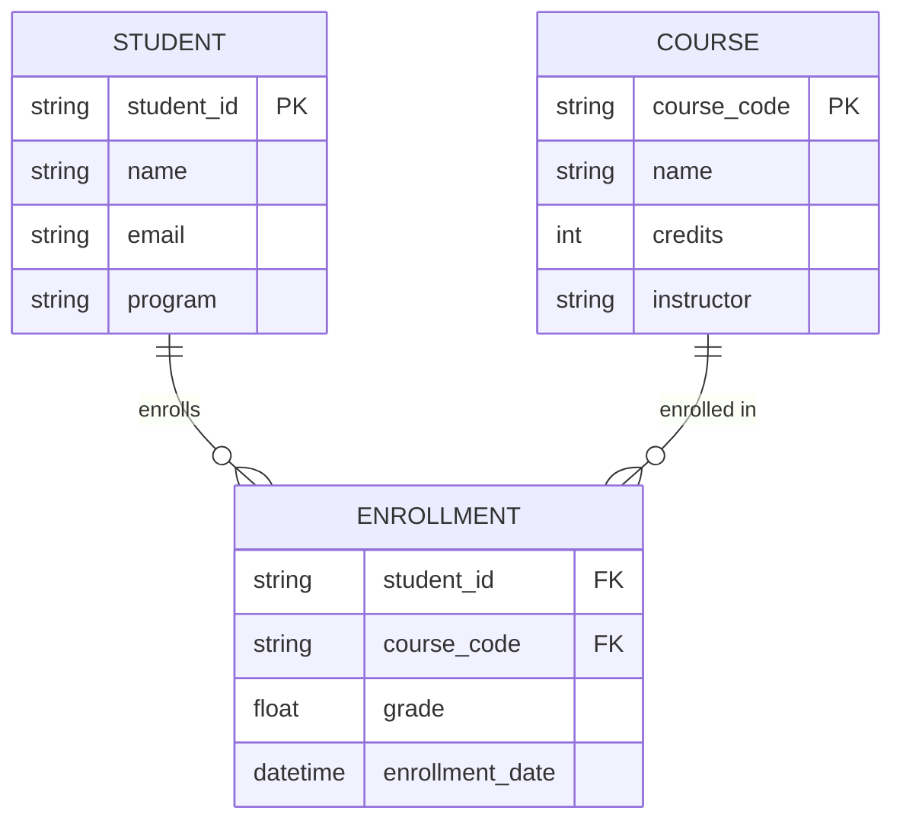

# Data Structures

## Overview

The Student Course Management System uses Python's built-in data structures (lists, dictionaries) combined with custom classes to represent domain entities. This document describes the data models and their implementations.

## Core Data Models

### Student Model

#### Structure
```python
class Student:
    """Represents a student in the system."""
    
    def __init__(self, student_id: str, name: str, email: str, program: str):
        self.student_id = student_id
        self.name = name
        self.email = email
        self.program = program
```

#### Attributes

| Attribute | Type | Description | Constraints |
|-----------|------|-------------|-------------|
| `student_id` | `str` | Unique student identifier | Required, unique, non-empty |
| `name` | `str` | Student's full name | Required, non-empty |
| `email` | `str` | Student's email address | Required, valid email format |
| `program` | `str` | Academic program | Required, non-empty |

#### Methods
- `validate()`: Validates student data
- `to_dict()`: Converts student to dictionary for serialization
- `from_dict(data)`: Creates student from dictionary
- `__str__()`: String representation
- `__repr__()`: Developer-friendly representation

---

### Course Model

#### Structure
```python
class Course:
    """Represents a course in the system."""
    
    def __init__(self, course_code: str, name: str, credits: int, instructor: str):
        self.course_code = course_code
        self.name = name
        self.credits = credits
        self.instructor = instructor
```

#### Attributes

| Attribute | Type | Description | Constraints |
|-----------|------|-------------|-------------|
| `course_code` | `str` | Unique course identifier | Required, unique, format: XXX1234 |
| `name` | `str` | Course name | Required, non-empty |
| `credits` | `int` | Number of credits | Required, 1-6 range |
| `instructor` | `str` | Instructor name | Required, non-empty |

#### Methods
- `validate()`: Validates course data
- `to_dict()`: Converts course to dictionary
- `from_dict(data)`: Creates course from dictionary
- `__str__()`: String representation
- `__repr__()`: Developer-friendly representation

---

### Enrollment Model

#### Structure
```python
class Enrollment:
    """Represents a student's enrollment in a course."""
    
    def __init__(self, student_id: str, course_code: str, grade: Optional[float] = None):
        self.student_id = student_id
        self.course_code = course_code
        self.grade = grade
        self.enrollment_date = datetime.now()
```

#### Attributes

| Attribute | Type | Description | Constraints |
|-----------|------|-------------|-------------|
| `student_id` | `str` | Reference to student | Required, must exist |
| `course_code` | `str` | Reference to course | Required, must exist |
| `grade` | `Optional[float]` | Course grade (0-100) | Optional, 0-100 if set |
| `enrollment_date` | `datetime` | Date of enrollment | Auto-generated |

#### Methods
- `validate()`: Validates enrollment data
- `calculate_letter_grade()`: Converts numeric to letter grade
- `to_dict()`: Converts enrollment to dictionary
- `from_dict(data)`: Creates enrollment from dictionary
- `__str__()`: String representation

---

## Data Collections

### StudentCollection

Manages collection of students using a dictionary for O(1) lookups.

```python
class StudentCollection:
    """Collection of students with efficient lookup."""
    
    def __init__(self):
        self._students: Dict[str, Student] = {}
    
    def add(self, student: Student) -> None:
        """Add a student to the collection."""
        
    def get(self, student_id: str) -> Optional[Student]:
        """Retrieve a student by ID."""
        
    def remove(self, student_id: str) -> bool:
        """Remove a student from collection."""
        
    def list_all(self) -> List[Student]:
        """Get all students."""
        
    def search(self, criteria: Dict) -> List[Student]:
        """Search students by criteria."""
```

**Time Complexity**:
- Add: O(1)
- Get: O(1)
- Remove: O(1)
- List All: O(n)
- Search: O(n)

### CourseCollection

Similar to StudentCollection but for courses.

```python
class CourseCollection:
    """Collection of courses with efficient lookup."""
    
    def __init__(self):
        self._courses: Dict[str, Course] = {}
```

**Time Complexity**: Same as StudentCollection

### EnrollmentCollection

Manages enrollments with multi-index support for efficient queries.

```python
class EnrollmentCollection:
    """Collection of enrollments with multi-index support."""
    
    def __init__(self):
        self._enrollments: List[Enrollment] = []
        self._student_index: Dict[str, List[Enrollment]] = {}
        self._course_index: Dict[str, List[Enrollment]] = {}
```

**Indexes**:
- Primary: List of all enrollments
- Student Index: Enrollments by student_id
- Course Index: Enrollments by course_code

**Time Complexity**:
- Add: O(1) amortized
- Get by Student: O(1) average
- Get by Course: O(1) average
- Update: O(n) where n = enrollments for a student

---

## Data Validation

### Validation Rules

#### Student Validation
```python
def validate_student(student: Student) -> List[str]:
    """Validate student data. Returns list of error messages."""
    errors = []
    
    # ID validation
    if not student.student_id or not student.student_id.strip():
        errors.append("Student ID is required")
    
    # Name validation
    if not student.name or not student.name.strip():
        errors.append("Name is required")
    
    # Email validation
    if not is_valid_email(student.email):
        errors.append("Invalid email format")
    
    # Program validation
    if not student.program or not student.program.strip():
        errors.append("Program is required")
    
    return errors
```

#### Course Validation
```python
def validate_course(course: Course) -> List[str]:
    """Validate course data. Returns list of error messages."""
    errors = []
    
    # Code validation
    if not re.match(r'^[A-Z]{3}\d{4}$', course.course_code):
        errors.append("Course code must be format: XXX1234")
    
    # Credits validation
    if not 1 <= course.credits <= 6:
        errors.append("Credits must be between 1 and 6")
    
    return errors
```

#### Enrollment Validation
```python
def validate_enrollment(enrollment: Enrollment, 
                       students: StudentCollection,
                       courses: CourseCollection) -> List[str]:
    """Validate enrollment data. Returns list of error messages."""
    errors = []
    
    # Check student exists
    if not students.get(enrollment.student_id):
        errors.append("Student not found")
    
    # Check course exists
    if not courses.get(enrollment.course_code):
        errors.append("Course not found")
    
    # Grade validation
    if enrollment.grade is not None:
        if not 0 <= enrollment.grade <= 100:
            errors.append("Grade must be between 0 and 100")
    
    return errors
```

---

## Data Relationships

### Entity Relationship Diagram



### Referential Integrity

- **Cascade Delete**: When a student is deleted, all their enrollments are removed
- **Cascade Delete**: When a course is deleted, all enrollments for that course are removed
- **Enrollment Constraint**: Cannot enroll a student in the same course twice

---

## Memory Management

### Object Lifecycle

1. **Creation**: Objects created via constructors
2. **Validation**: Immediate validation on creation or update
3. **Storage**: Added to appropriate collections
4. **Retrieval**: Retrieved via collections
5. **Update**: Modified in place, re-validated
6. **Deletion**: Removed from collections, references cleared

### Python Memory Considerations

- **Garbage Collection**: Python automatically manages memory
- **Circular References**: Avoided in current design
- **Large Datasets**: For very large datasets, consider pagination

---

## Serialization

### JSON Format

#### Student JSON
```json
{
  "student_id": "S001",
  "name": "John Doe",
  "email": "john.doe@example.com",
  "program": "Computer Science"
}
```

#### Course JSON
```json
{
  "course_code": "CSC1234",
  "name": "Introduction to Programming",
  "credits": 3,
  "instructor": "Dr. Smith"
}
```

#### Enrollment JSON
```json
{
  "student_id": "S001",
  "course_code": "CSC1234",
  "grade": 85.5,
  "enrollment_date": "2024-01-15T10:30:00"
}
```

---

## Performance Characteristics

### Space Complexity

| Structure | Space Complexity | Notes |
|-----------|-----------------|-------|
| StudentCollection | O(n) | n = number of students |
| CourseCollection | O(m) | m = number of courses |
| EnrollmentCollection | O(k + k + k) = O(k) | k = enrollments, 3x for indexes |

### Time Complexity Summary

| Operation | Student | Course | Enrollment |
|-----------|---------|--------|------------|
| Add | O(1) | O(1) | O(1) |
| Get by ID | O(1) | O(1) | O(n)* |
| Update | O(1) | O(1) | O(n)* |
| Delete | O(1) | O(1) | O(n)* |
| List All | O(n) | O(m) | O(k) |
| Search | O(n) | O(m) | O(k) |

*With indexes: O(1) average case

---

## Best Practices

### Model Design
1. Keep models simple and focused
2. Validate data at model level
3. Use type hints for clarity
4. Implement `__str__` and `__repr__`
5. Provide serialization methods

### Collection Management
1. Use appropriate data structures
2. Maintain indexes for frequent queries
3. Keep collections consistent
4. Handle edge cases (empty, duplicates)

### Data Integrity
1. Validate before adding to collections
2. Enforce referential integrity
3. Use transactions for multi-step operations
4. Provide clear error messages
