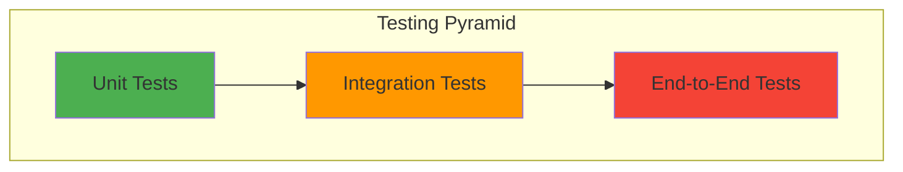

# Testing Guide

## Overview

This document describes the testing strategy, procedures, and guidelines for the Student Course Management System.

## Testing Strategy

### Testing Pyramid



- **Unit Tests (70%)**: Test individual functions and classes
- **Integration Tests (20%)**: Test component interactions
- **End-to-End Tests (10%)**: Test complete user workflows

---

## Running Tests

### All Tests
```bash
poetry run pytest
```

### With Coverage
```bash
poetry run pytest --cov=student_management --cov-report=html
```

### Specific Test File
```bash
poetry run pytest tests/test_student.py
```

### Specific Test Function
```bash
poetry run pytest tests/test_student.py::test_create_student
```

### Verbose Output
```bash
poetry run pytest -v
```

### Stop on First Failure
```bash
poetry run pytest -x
```

---

## Test Structure

### Directory Layout
```
tests/
├── __init__.py
├── conftest.py              # Shared fixtures
├── test_student.py          # Student model tests
├── test_course.py           # Course model tests
├── test_enrollment.py       # Enrollment model tests
├── test_student_service.py  # Student service tests
├── test_course_service.py   # Course service tests
├── test_enrollment_service.py
├── test_file_handler.py     # File I/O tests
├── test_menu.py             # UI tests
└── test_data/               # Test data files
    ├── sample_students.json
    ├── sample_courses.json
    └── sample_enrollments.json
```

---

## Unit Tests

### Testing Models

#### Example: Student Model Test
```python
import pytest
from student_management.models.student import Student

def test_create_student():
    """Test student creation."""
    student = Student("S001", "John Doe", "john@example.com", "CS")
    assert student.student_id == "S001"
    assert student.name == "John Doe"

def test_student_validation_empty_id():
    """Test validation fails with empty ID."""
    student = Student("", "John Doe", "john@example.com", "CS")
    errors = student.validate()
    assert len(errors) > 0
    assert any("student_id" in err.lower() or "id" in err.lower() for err in errors)

def test_student_validation_invalid_email():
    """Test validation fails with invalid email."""
    student = Student("S001", "John Doe", "invalid-email", "CS")
    errors = student.validate()
    assert any("email" in err.lower() for err in errors)

def test_student_to_dict():
    """Test student serialization."""
    student = Student("S001", "John Doe", "john@example.com", "CS")
    data = student.to_dict()
    assert data["student_id"] == "S001"
    assert data["name"] == "John Doe"

def test_student_from_dict():
    """Test student deserialization."""
    data = {
        "student_id": "S001",
        "name": "John Doe",
        "email": "john@example.com",
        "program": "CS"
    }
    student = Student.from_dict(data)
    assert student.student_id == "S001"
```

### Testing Services

#### Example: Student Service Test
```python
import pytest
from student_management.services.student_service import StudentService
from student_management.data.file_handler import FileHandler

@pytest.fixture
def student_service(tmp_path):
    """Create a student service with temporary storage."""
    file_handler = FileHandler(tmp_path)
    return StudentService(file_handler)

def test_create_student(student_service):
    """Test creating a student."""
    student = student_service.create_student(
        "S001", "John Doe", "john@example.com", "CS"
    )
    assert student.student_id == "S001"

def test_create_duplicate_student(student_service):
    """Test creating duplicate student raises error."""
    student_service.create_student(
        "S001", "John Doe", "john@example.com", "CS"
    )
    with pytest.raises(ValueError, match="already exists"):
        student_service.create_student(
            "S001", "Jane Doe", "jane@example.com", "SE"
        )

def test_get_student(student_service):
    """Test retrieving a student."""
    student_service.create_student(
        "S001", "John Doe", "john@example.com", "CS"
    )
    student = student_service.get_student("S001")
    assert student is not None
    assert student.name == "John Doe"

def test_get_nonexistent_student(student_service):
    """Test retrieving non-existent student returns None."""
    student = student_service.get_student("S999")
    assert student is None

def test_update_student(student_service):
    """Test updating student information."""
    student_service.create_student(
        "S001", "John Doe", "john@example.com", "CS"
    )
    updated = student_service.update_student("S001", email="newemail@example.com")
    assert updated.email == "newemail@example.com"

def test_delete_student(student_service):
    """Test deleting a student."""
    student_service.create_student(
        "S001", "John Doe", "john@example.com", "CS"
    )
    result = student_service.delete_student("S001")
    assert result is True
    assert student_service.get_student("S001") is None
```

---

## Integration Tests

### Testing Component Interactions

#### Example: Enrollment Integration Test
```python
import pytest
from pathlib import Path
from student_management.data.file_handler import FileHandler
from student_management.services.student_service import StudentService
from student_management.services.course_service import CourseService
from student_management.services.enrollment_service import EnrollmentService

@pytest.fixture
def services(tmp_path):
    """Create all services with temporary storage."""
    file_handler = FileHandler(tmp_path)
    student_service = StudentService(file_handler)
    course_service = CourseService(file_handler)
    enrollment_service = EnrollmentService(
        file_handler, student_service, course_service
    )
    return student_service, course_service, enrollment_service

def test_enrollment_workflow(services):
    """Test complete enrollment workflow."""
    student_svc, course_svc, enrollment_svc = services
    
    # Create student
    student = student_svc.create_student(
        "S001", "John Doe", "john@example.com", "CS"
    )
    
    # Create course
    course = course_svc.create_course(
        "CSC1234", "Intro to Programming", 3, "Dr. Smith"
    )
    
    # Enroll student
    enrollment = enrollment_svc.enroll_student("S001", "CSC1234")
    assert enrollment.student_id == "S001"
    assert enrollment.course_code == "CSC1234"
    
    # Update grade
    updated = enrollment_svc.update_grade("S001", "CSC1234", 85.5)
    assert updated.grade == 85.5
    
    # Calculate GPA
    gpa = enrollment_svc.calculate_gpa("S001")
    assert gpa > 0

def test_cascade_delete(services):
    """Test that deleting student removes enrollments."""
    student_svc, course_svc, enrollment_svc = services
    
    # Setup
    student_svc.create_student("S001", "John Doe", "john@example.com", "CS")
    course_svc.create_course("CSC1234", "Intro to Programming", 3, "Dr. Smith")
    enrollment_svc.enroll_student("S001", "CSC1234")
    
    # Delete student
    student_svc.delete_student("S001")
    
    # Verify enrollments removed
    enrollments = enrollment_svc.get_student_enrollments("S001")
    assert len(enrollments) == 0
```

---

## Test Fixtures

### Common Fixtures (conftest.py)

```python
import pytest
from pathlib import Path
from student_management.data.file_handler import FileHandler
from student_management.models.student import Student
from student_management.models.course import Course

@pytest.fixture
def temp_data_dir(tmp_path):
    """Provide a temporary data directory."""
    return tmp_path

@pytest.fixture
def file_handler(temp_data_dir):
    """Provide a FileHandler with temporary directory."""
    return FileHandler(temp_data_dir)

@pytest.fixture
def sample_student():
    """Provide a sample student."""
    return Student("S001", "John Doe", "john@example.com", "CS")

@pytest.fixture
def sample_course():
    """Provide a sample course."""
    return Course("CSC1234", "Intro to Programming", 3, "Dr. Smith")

@pytest.fixture
def sample_students():
    """Provide multiple sample students."""
    return [
        Student("S001", "John Doe", "john@example.com", "CS"),
        Student("S002", "Jane Smith", "jane@example.com", "SE"),
        Student("S003", "Bob Johnson", "bob@example.com", "CS"),
    ]
```

---

## Test Data

### Sample Data Files

#### tests/test_data/sample_students.json
```json
{
  "students": [
    {
      "student_id": "S001",
      "name": "John Doe",
      "email": "john@example.com",
      "program": "Computer Science"
    },
    {
      "student_id": "S002",
      "name": "Jane Smith",
      "email": "jane@example.com",
      "program": "Software Engineering"
    }
  ],
  "metadata": {
    "version": "1.0",
    "count": 2
  }
}
```

---

## Testing Best Practices

### 1. Test Naming
- Use descriptive names: `test_<function>_<scenario>_<expected>`
- Example: `test_create_student_with_invalid_email_raises_error`

### 2. Arrange-Act-Assert Pattern
```python
def test_example():
    # Arrange
    student = Student("S001", "John Doe", "john@example.com", "CS")
    
    # Act
    errors = student.validate()
    
    # Assert
    assert len(errors) == 0
```

### 3. One Assertion Per Test
```python
def test_student_id():
    student = Student("S001", "John Doe", "john@example.com", "CS")
    assert student.student_id == "S001"

def test_student_name():
    student = Student("S001", "John Doe", "john@example.com", "CS")
    assert student.name == "John Doe"
```

### 4. Use Fixtures
```python
@pytest.fixture
def student():
    return Student("S001", "John Doe", "john@example.com", "CS")

def test_something(student):
    # Use fixture
    assert student.student_id == "S001"
```

### 5. Test Edge Cases
- Empty strings
- None values
- Boundary values (0, -1, max)
- Invalid formats
- Duplicate entries

---

## Manual Testing Procedures

### Test Scenarios

#### Scenario 1: Student Management
1. **Add Student**
   - Input: Valid student data
   - Expected: Student created, success message
   - Verify: Student appears in list

2. **Add Duplicate Student**
   - Input: Existing student ID
   - Expected: Error message
   - Verify: Original student unchanged

3. **Search Student**
   - Input: Student ID
   - Expected: Student details displayed
   - Verify: Correct information shown

4. **Update Student**
   - Input: New email
   - Expected: Student updated
   - Verify: Changes persisted

5. **Delete Student**
   - Input: Student ID
   - Expected: Student removed
   - Verify: Student no longer in list

#### Scenario 2: Course Management
Similar to student management

#### Scenario 3: Enrollment
1. **Enroll Student**
   - Pre-condition: Student and course exist
   - Input: Student ID, course code
   - Expected: Enrollment created
   - Verify: Appears in both student and course views

2. **Update Grade**
   - Pre-condition: Enrollment exists
   - Input: New grade
   - Expected: Grade updated
   - Verify: GPA recalculated

3. **Drop Course**
   - Pre-condition: Enrollment exists
   - Input: Student ID, course code
   - Expected: Enrollment removed
   - Verify: GPA recalculated

---

## Coverage Requirements

### Target Coverage
- **Overall**: 80% minimum
- **Models**: 90% minimum
- **Services**: 85% minimum
- **Data Layer**: 80% minimum

### Viewing Coverage Report
```bash
poetry run pytest --cov=student_management --cov-report=html
open htmlcov/index.html
```

---

## Continuous Integration

### GitHub Actions Workflow
```yaml
name: Tests

on: [push, pull_request]

jobs:
  test:
    runs-on: ubuntu-latest
    
    steps:
      - uses: actions/checkout@v2
      - uses: actions/setup-python@v2
        with:
          python-version: '3.11'
      
      - name: Install Poetry
        run: pip install poetry
      
      - name: Install dependencies
        run: poetry install
      
      - name: Run tests
        run: poetry run pytest --cov=student_management
      
      - name: Run linting
        run: poetry run flake8 student_management
      
      - name: Run type checking
        run: poetry run mypy student_management
```

---

## Debugging Tests

### Using pdb
```python
def test_example():
    import pdb; pdb.set_trace()
    # Debug here
    assert True
```

### Print Debugging
```python
def test_example(capfd):
    print("Debug output")
    student = Student("S001", "John Doe", "john@example.com", "CS")
    out, err = capfd.readouterr()
    assert "Debug output" in out
```

### Verbose Pytest Output
```bash
poetry run pytest -vv -s
```

---

## Performance Testing

### Example Performance Test
```python
import time

def test_bulk_student_creation_performance(student_service):
    """Test creating 1000 students completes in reasonable time."""
    start = time.time()
    
    for i in range(1000):
        student_service.create_student(
            f"S{i:04d}",
            f"Student {i}",
            f"student{i}@example.com",
            "CS"
        )
    
    duration = time.time() - start
    assert duration < 5.0  # Should complete in under 5 seconds
```

---

## Test Documentation

Each test should have a docstring explaining:
- What is being tested
- Expected behavior
- Edge cases covered

```python
def test_create_student_with_long_name(student_service):
    """
    Test creating a student with a very long name.
    
    The system should handle names up to 100 characters.
    This test verifies the upper boundary of nameField length validation.
    """
    long_name = "A" * 100
    student = student_service.create_student(
        "S001", long_name, "john@example.com", "CS"
    )
    assert student.name == long_name
```
